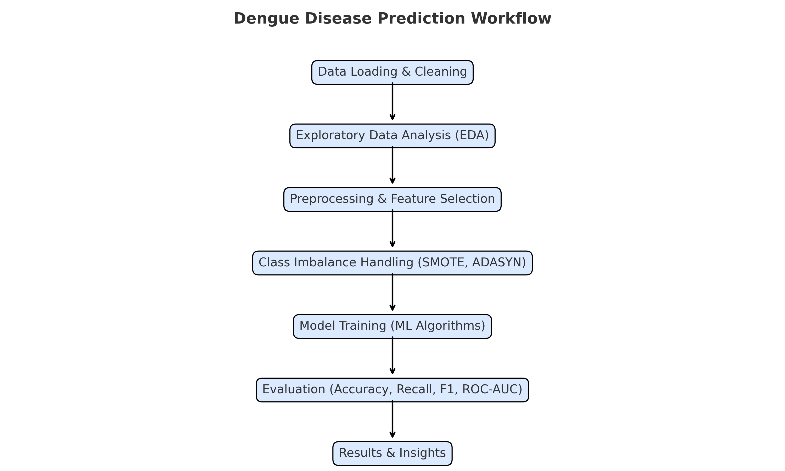

# 🦟 Ensemble Learning-Based Dengue Prediction from Hematological Features  

## 📌 Overview  
This project proposes an ensemble learning-based  dengue prediction system using hematological features. By integrating models such as Logistic Regression, Random Forest, Gradient Boosting, XGBoost, LightGBM, and CatBoost into an optimized ensemble, the system enhances diagnostic accuracy, robustness, and generalization compared to conventional methods and individual classifiers.

---

## 📊 Dataset  
- **Source:** Dengue diseases dataset (CSV)  
- **Target:** `Final Output` (disease outcome)  
- **Features:** Numerical & categorical variables  
- **Preprocessing:** Missing value imputation, encoding, scaling  
- **Balancing:** SMOTE, ADASYN, Random Oversampling/Undersampling  

---

## 🔄 Workflow  

  

---

## 🛠 Code Workflow  
1. Data loading & cleaning  
2. Exploratory Data Analysis (EDA)  
3. Feature selection & preprocessing  
4. Class imbalance handling  
5. Model training: Logistic Regression, Decision Tree, Random Forest, SVM, Naive Bayes, KNN, Gradient Boosting, XGBoost, LightGBM, CatBoost  
6. Evaluation with Accuracy, Precision, Recall, F1, ROC-AUC  

---

## 📈 Results  
- **Best models:** Random Forest, Gradient Boosting, XGBoost  
- Imbalance handling improved **recall and F1-scores**  
- Traditional ML achieved high accuracy → deep learning not required  

---

## 🚀 Future Work  
- Hyperparameter tuning (GridSearch/Optuna)  
- Validation with external datasets  
- Deployment as API or Web App for real-time predictions  

---

⚡ **Built with:** Python, Scikit-learn, Imbalanced-learn, XGBoost, LightGBM, CatBoost, Pandas, Seaborn, Matplotlib  
